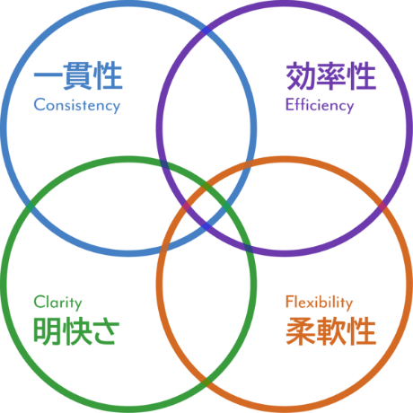

## 思い描く業務の姿を可能にする
iMDSはデザインの根本的理解と提唱している原則を基に理想的な業務を実現をするデザインシステムであり、intra-martの高品質なデジタルエクスペリエンスを構築するのに役立ちます。

---



IM-DSは以下の４つの原則でどうたらこうたら

<flex>
  <card title="一貫性">
    デザインに一貫性を担保しましょう。一貫性のあるデザインは、intra-martの持つ幅広い機能群の画面間においてシームレスな操作を可能にし、快適なユーザ体験を実現します。
  </card>
  <card title="効率性">
    ユーザが効率よく作業できるようなデザインを心がけましょう。デザインを最適化することで、ユーザはより早く、より少ない労力で作業を完了できるようになります。
  </card>
  <card title="明快さ">
    ユーザが迷わずシステムを利用できるよう、わかりやすいデザインを心がけましょう。明快なデザインは、システムの利用方法のみならず、ユーザのタスクや業務全体をも明確にします。
  </card>
  <card title="柔軟性">
    デザインに柔軟性を持たせましょう。予測不可能に変化する条件に適応し、あらゆるユーザが使えるような柔軟性を持ったデザインは、より多くのユーザのUXを向上させます。
  </card>
</flex>


# Heading H1
Heading 1 text

## Heading H2
Heading 2 text

### Heading H3
Heading 3 text

#### Heading H4
Heading 4 text

##### Heading H5
Heading 5 text

###### Heading H6
Heading 6 text


<div style="border: solid 1px #aaa">
<h2>Hello, Venus!</h2>
<h2>Hello, Mars!</h2>
</div>

<flex>
  <card title="title">
    aaaaa
  </card>
  <card>
    ## aaaa
    aaaaa
  </card>
  <card>
    ## aaaa
    aaaaa
  </card>
</flex>

---

# fonts
**bold text**

*italicized text*
> blockquote

---

# Lists

### li
- Item 1
- Item 2
- Item 3
- Item 4
- Item 5

### ol
1. First item
2. Second item
3. Third item

* aaaaaaaaaaa
  * sss
    * sss
      * sss


`code
aaaaaaaaaaa
aaaaaaaaaaaa
`

---

[title](https://www.example.com)


| Syntax | Description |
| ----------- | ----------- |
| Header | Title |
| Paragraph | Text |

```
{
  "firstName": "John",
  "lastName": "Smith",
  "age": 25
}
```

Here's a sentence with a footnote. [^1]

[Alpha]: https://example.com

*alpha* _bravo_

[alpha][Bravo]

![alpha][bravo]

[^alpha]: bravo and charlie.

^[alpha bravo]

[^alpha]

**alpha** __bravo__

---
foo: bar
---

[^1]: This is the footnote.

### My Great Heading {#custom-id}

First Term
: This is the definition of the first term.

Second Term
: This is one definition of the second term.
: This is another definition of the second term.

~~The world is flat.~~

- [x] Write the press release
- [ ] Update the website
- [ ] Contact the media